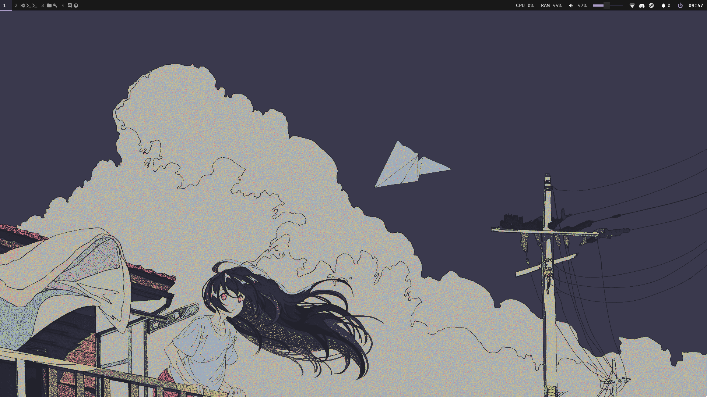

# NixOS Configuration

Personal NixOS configuration for my workstation, managed declaratively
with [NixOS](https://nixos.org/), [Home
Manager](https://github.com/nix-community/home-manager) and Flakes.



## Overview

This repository contains personal NixOS configurations for one or more hosts.
The examples below use `odin`, one of the configured hosts.

The desktop environment is built around:

-   Sway / Wayland
-   Waybar
-   Foot
-   Fuzzel
-   Mako
-   Thunar
-   greetd + tuigreet
-   Home Manager

The configuration also includes my development environment and tools for
Nix, Python, Kubernetes and general system administration.

## Structure

``` text
.
├── assets/             # Screenshots and repository assets
├── home/gaetinux/      # User configuration managed by Home Manager
├── hosts/              # Host-specific configuration
├── modules/            # Shared NixOS modules
├── flake.nix
└── flake.lock
```

## Usage

### Rebuild

Apply the configuration for a host, using `odin` as an example:

``` bash
sudo nixos-rebuild switch --flake .#odin
```

Build the configuration without activating it:

``` bash
sudo nixos-rebuild build --flake .#odin
```

### Update

Update all flake inputs:

``` bash
nix flake update
```

Then apply the updated configuration:

``` bash
sudo nixos-rebuild switch --flake .#odin
```

The resulting `flake.lock` should be committed to keep the configuration
reproducible.

### Check

Validate the flake before applying changes:

``` bash
nix flake check
```

Format the Nix files in the repository:

``` bash
nix fmt
```

Check formatting without modifying files:

``` bash
nix fmt -- --ci
```

The formatter currently targets `x86_64-linux`.

## Porting to another host

Each directory under `hosts/` contains host-specific hardware and system
settings. The files under `hosts/odin/` should not be copied unchanged to
another machine.

To add another host, generate its hardware configuration, create a host module,
and add a new entry to `nixosConfigurations` in `flake.nix`:

``` bash
sudo nixos-generate-config --show-hardware-config \
  > hosts/<hostname>/hardware-configuration.nix
```

## Garbage collection

The Nix store is cleaned automatically by `modules/nix.nix`. A weekly timer
deletes system generations older than 30 days, and the store is deduplicated
afterwards. Both run on Monday evening (21:30 and 22:15), at idle CPU and I/O
priority: this machine is powered off at night, so a nightly timer would only
ever be caught up shortly after the next boot.

The timers are `Persistent`, so a Monday spent powered off is still caught up
at the next boot rather than skipped.

Trigger a collection immediately when space is needed sooner:

``` bash
sudo systemctl start nix-gc.service
```

The automatic collection does not cover the current user's own Nix profile.
Clean it separately when needed:

``` bash
nix-collect-garbage -d
```

Inspect both timers:

``` bash
systemctl list-timers nix-gc.timer nix-optimise.timer
```

## Notes

This repository contains my personal NixOS configuration and evolves alongside
my systems.

Host-specific settings belong in `hosts/`, reusable system configuration
in `modules/`, and user-level configuration in `home/gaetinux/`.
